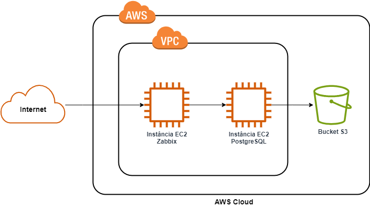

<div align='center'>
 

 
 </div>

# Teste para vaga de Analista de Infraestrutura - Magazord
Este repositório tem como finalidade avaliar os candidatos para vaga de Analista de Infraestrutura na empresa [Magazord](https://magazord.com.br).
> Para esta vaga buscamos alguém apaixonado por tecnologia e atento aos detalhes!


## O teste

As questões aqui apresentadas visam avaliar o nível de conhecimento do candidato. Leia com atenção as recomendações abaixo:

> [!NOTE]
> O candidato deve ter acesso à uma conta AWS para conseguir responder às questões.

 > [!IMPORTANT]
 > **É possível criar uma conta AWS usando email pessoal e usar os recursos demandados pela avaliação, sem custos.**

> [!NOTE]
> A solução proposta deve atender minimamente ao enunciado da questão. Fica a critério do candidato a complementação da questão com o uso de ferramentas e procedimentos adicionais;
> Todos os scripts e etapas realizadas devem ser documentadas de maneira organizada;

> [!NOTE]
> Para correta validação das atividades, lembre-se de expor publicamente as portas necessárias.


Com base no cenário abaixo apresentado, elabore soluções e respostas para as questões apresentadas após a imagem.




## Questões:

  1. Crie a estrutura proposta (imagem anterior) na AWS, na região us-east-1:
     - Virtual Private Cloud (VPC);
       - Instância EC2 - Zabbix (t2.micro se enquadra em free tier);
       - Instância EC2 - PostgreSQL (t2.micro se enquadra em free tier);
  2. Na Instância EC2 - Zabbix, configure um servidor Zabbix com banco de dados de sua preferência, limitando o acesso externo à este servidor nas portas 80/443 apenas ao seu IP público e ao IP 45.7.128.158/32.
  3. Na Instância EC2 - PostgreSQL, instale o serviço de banco de dados PostgreSQL, configure-o para inicializar automaticamente com o sistema operacional e responder apenas às requisições da máquina local. Ainda nesta instância, instale e configure o agente Zabbix, assim como o monitoramento básico do sistema operacional desta instância (recursos de CPU/Memória/Disco).
  4. No servidor de banco de dados, execute o script abaixo para criação de um banco que será usado como base para a próxima atividade:
      ```
     CREATE DATABASE testdb;
     CREATE TABLE table1 (
      column1 integer,
      column2 integer);
     
     INSERT INTO table1 (column1)
     SELECT a.column1 FROM generate_series(1, 1000000) AS a (column1);
     ```
  5. Crie um script (ShellScript ou Python) para geração de backup do banco de dados criado na etapa 4, com cópia para um bucket S3.

## Envio do teste

Sua entrega deve conter:
- Script criado para backup da base de dados;
- Documentação dos passos executados durante a realização das questões;
- Endereço público para acesso ao servidor Zabbix, assim como as credenciais de acesso.

* Suba tudo em um repositório público seu do Github e informe a URL de acesso ao seu recrutador.
Obs.: Não serão aceitos alterações após o envio.
